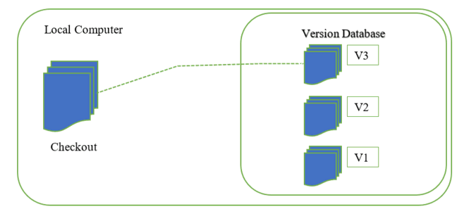
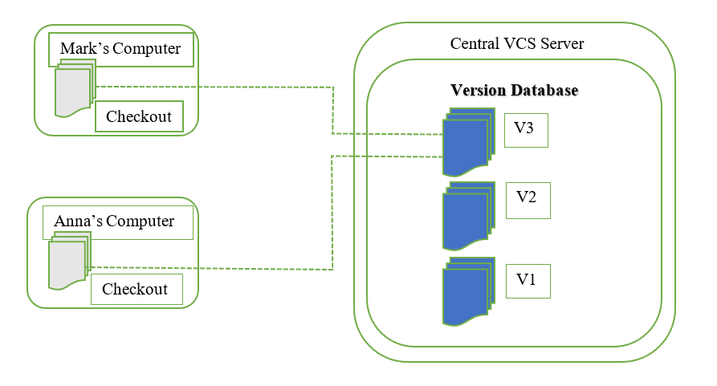
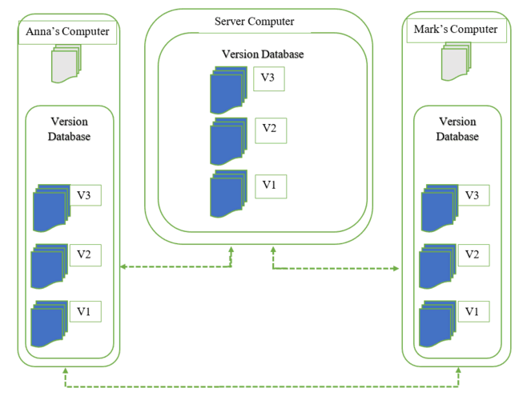
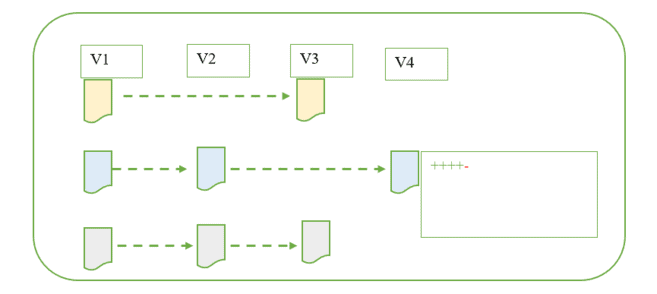
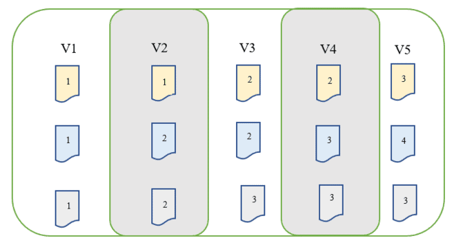
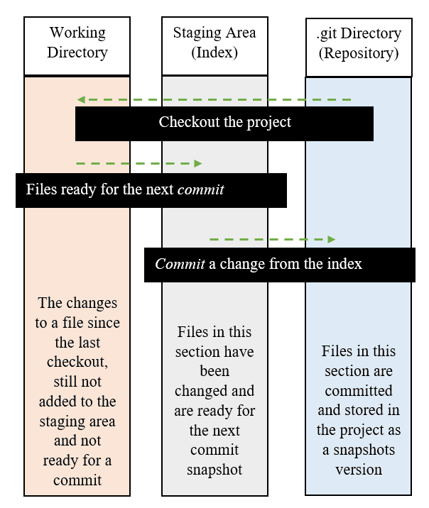
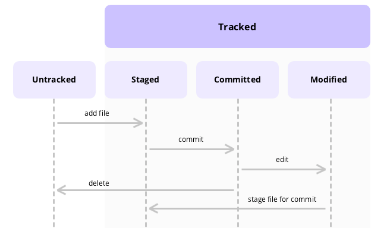

# GIT, GIT-FLOW

## Phần 1: Tổng quan

### 1. Version Control System (VCS)

#### 1.1. Giới thiệu
- VCS là một hệ thống giúp quản lý và theo dõi sự thay đổi của các file và dữ liệu trong quá trình phát triển phần mềm hoặc các dự án phần mềm khác. 
- VCS giúp:
  - Theo dõi các thay đổi, người thay đổi đã thức hiện trước đó.
  - Khôi phục lại phiên bản cũ của các file hay toàn bộ dự án.
  - Quản lý các thay đổi hiệu quả khi nhiều người cùng tham gia một dự án.
  - Giảm thiểu xung đột giữa các phiên bản khác nhau của dự án, đảm bảo tính nhất quán.

#### 1.2. Các loại VCS chính
**LVCSs (Local Version Control Sytems)**

Hệ thống quản lý phiên bản cục bộ

  
- LVCS là database cục bộ nằm trên máy tính cục bộ, trong đó mọi thay đổi tệp được lưu trữ dưới dạng các bản vá.
- Mỗi bộ bản vá chỉ chứa các thay đổi được thực hiện đối với tệp kể từ phiên bản cuối cùng của nó.
- Nhược điểm:
  - Do lưu trữ cục bộ nên các bản vá sẽ có thể bị mất/lỗi.
  - Bất cứ lỗi nào xảy ra ở version nào đó, mọi thay đổi sau đó cũng có thể bị mất/lỗi.
  - Khó làm việc theo nhóm.

**CVCSs (Centralized Version Control Sytems)**

Hệ thống quản lý phiên bản tập trung

  
- Tất cả các phiên bản của file trong dự án sẽ nằm tập trung tại 1 server lớn duy nhất (Central repository).
- Làm việc nhóm dễ dàng hơn LVCS.
- Cho phép nhiều người có thể truy cập, lấy code về và đẩy code lên server.
- Admin có thể kiểm soát được hoạt động của các thành viên trong dự án.
- Nhược điểm: Do dữ liệu tập trung hết ở server, nếu server gặp lỗi -> toàn bộ dữ liệu mất/hỏng, chỉ còn dữ liệu trên máy cục bộ.

**DVCSs (Distributed Version Control Sytems)**

Hệ thống quản lý phiên bản phân tán

  
- Các máy khách có thể truy cập, pull toàn bộ lịch sử các version về máy local.
- Mọi người sẽ làm việc với bản sao của toàn bộ dự án trên máy local. 
- Nếu server bị lỗi/hỏng, bất kỳ ai có bản sao của dự án đều có thể gửi đến người khác hoặc gửi lại lên server.
- Git là một ví dụ điển hình cho mô hình DVCS.

### 2. Git
#### 2.1. Git là gì?
- Git là một hệ thống quản lý phiên bản phân tán (DVCS) được phát triển bởi Linus Torvalds vào năm 2005. 
- Git được sử dụng rộng rãi để quản lý mã nguồn và dữ liệu của các dự án phần mềm, cho phép nhiều người cùng làm việc trên cùng một dự án một cách hiệu quả.
- Mục tiêu chính của hệ thống:
  - Nhanh
  - Thiết kế đơn giản
  - Hỗ trợ tốt cho phát triển phi tuyển tính (non-linear development)
  - Phân tán toàn diện
  - Có khả năng xử lý các dự án lớn hiệu quả

#### 2.2. Hoạt động của Git
**Cách git lưu trữ dữ liệu về những thay đổi đối với file**
- Các VCS khác:

  - Theo dõi các thay đổi được thực hiện đối với các file và lưu lại thay đổi đã commit với file đó. 
  - Với mỗi phiên bản, chỉ thấy những thay đổi được thực hiện đối với một file cụ thể trong phiên bản đó -> Khiến cho việc xem trạng thái của toàn bộ dự án trở nên khó khăn hơn, đặc biệt đối với các file không có thay đổi nào trong một phiên bản cụ thể.
  - Để xem trạng thái hiện tại của các file, cần phải xem phiên bản mới nhất của nó và áp dụng các thay đổi đã lưu trữ từ các phiên bản trước đó.

    

- Git:

  - Coi dữ liệu như một tập các *snapshot* của toàn bộ hệ thống. Mỗi lần commit thì Git tạo một *snapshot* ghi lại nội dung của tất cả các tập tin tại một thời điểm đó và tạo một tham chiếu tới *snapshot* đó.
  - Tập tin không có thay đổi sẽ không lưu trữ lại mà chỉ tạo một liên kết tới tập tin gốc đã tồn tại trước đó.
  - Có thể recall bất kỳ *snapshot* nào được tạo và xem trạng thái của toàn bộ dự án với tất cả các file trong dự án. (Khác với trường hợp trước, chỉ thấy những thay đổi của các file, còn trường hợp này, mọi *snapshot* đều chứa tất cả các file)

    

**Git cục bộ**
- Tất cả các thay đổi được lưu cục bộ trên mọi máy. Nó có thể được đồng bộ hóa với server hoặc pull dữ liệu từ server.
- Khi pull dữ liệu từ server, ta có thể có được toàn bộ lịch sử của dự án trên máy cục bộ -> Vận hành sẽ mượt hơn do toàn bộ dữ liệu được lấy từ database cục bộ.

**Theo dõi thay đổi**
- Git lưu trữ mỗi file trong database bằng một mã băm SHA-1 duy nhất của nó, không phải bằng tên file. Khi file được thay đổi, Git tính toán một mã băm mới và lưu trữ phiên bản mới của file trong database dưới mã băm mới đó. Điều này giúp Git phát hiện thay đổi file và theo dõi lịch sử file hiệu quả hơn.
- Mỗi commit trong Git bao gồm các giá trị mã băm của tất cả các file đã được thay đổi trong commit đó, tạo thành một snapshot của dự án tại thời điểm đó. Khi muốn lấy một commit cụ thể, ta sử dụng mã băm để tìm nó.

#### 2.3. Ba trạng thái của Git

- Mỗi tập tin được quản lý dựa trên 3 trạng thái:
  - **_Commited_**: dữ liệu được lưu trữ an toàn trong database.
  - **_Modified_**: đã thay đổi tập tin nhưng chưa commit vào database.
  - **_Staged_**: đã đánh dấu sẽ commit phiên bản hiện tại của một tập tin đã chỉnh sửa trong lần commit sắp tới.

- Ba phần của một dự án sử dụng Git:

  - **_.git directory_** (repository): nơi git chứa metadata và database của dự án, được sao lưu khi clone từ máy tính khác.
  - **_working directory_**: là bản sao một phiên bản của dự án, được sử dụng để chỉnh sửa các file trong dự án.
  - **_staging area_** (index): là nơi nằm giữa _working directory_ và _.git directory_, các tệp đã sẵn sàng để commit được lưu trữ ở đây.

    

#### 2.4. Cài đặt Git
  - https://git-scm.com/book/en/v2/Getting-Started-Installing-Git

------------------------------------------

## Phần 2: Git cơ bản

### 2.1. Cấu hình git và khởi tạo repo 

- Cấu hình name và email của user trong main configuration file:
  ```
  git config -- global user.name=[name]
  git config -- global user.email=[email]
  ```

- Tạo một repo mới:

  ```
  git init
  ```
  
- Sao chép repo từ remote source:

  ```
  git clone [clone_git_url]
  ```
### 2.2. Xử lý thay đổi ở repo

- Trạng thái của file:
  - `tracked`: đã có mặt trong snapshot trước, chúng có thể là `unmodified`, `modified`, hoặc `staged`.
  - `untracked`:  file trong working directory mà không cho snapshot ở lần commit trước hoặc không ở trong staging area.

  

- Kiểm tra trạng thái của file đã thay đổi trong working directory:

  ```
  git status
  ```

- Đưa file vào staging area:

  ```
  git add [file_name]
  ```

- Bỏ qua các file: Tạo một tập tin mới có tên `.gitignore` và liệt kê các pattern muốn bỏ qua.

- Commit thay đổi:

  ```
  git commit -m [message]
  ```

- Xem lịch sử commit

  ```
  git log
  ```

### 2.3. Làm việc với branch
- Liệt kê tất cả các brach:
  ```
  git branch
  git branch -a
  ```
- Tạo một branch mới:
  ```
  git checkout -b [branch_name]
  ```
- Chuyển sang branch khác:
  ```
  git checkout [branch]
  ```
### 2.4. Hoàn tác
  
- Khi commit chưa như ý muốn và muốn thực hiện commit lại commit cuối cùng:

    ```
    [do something: add file,...]
    git commit --amend
    ```

- Loại bỏ tập tin đã đưa vào staging area:

  ```
  git reset HEAD [file_name]
  ```

### 2.5. Làm việc với remote

- Để liệt kê các máy chủ remote đã chỉ định:

  ```
  git remote
  ```

- Nếu sao chép từ một repository sẽ thấy ` bản gốc` (origin).
- Thêm remote:

  ```
  git remote add [remote_url]
  ```


------------------------------------------


## Phần 3: Gitflow workflow

### 3.1. Gitflow là gì?
- Gitflow chỉ là một ý tưởng trừu tượng về quy trình sử dụng Git. Nó chỉ ra cách thức setup các loại branch khác nhau và cách thức để merge chúng lại với nhau. 
- Mục đích:
  - Đảm bảo tính ổn định, độ tin cậy của sản phẩm
  - Tăng tính linh hoạt, tiện lợi
  - Quản lý branch rõ ràng, hiệu quả
  - Đánh giá hiệu quả làm việc của nhóm
  - Dễ bảo trì, quản lý
- git-flow là tên gọi của một model/tool hỗ trợ cho việc branch model để quản lý branch và đã hỗ trợ trên các hệ điều hành khác nhau.
  - git-flow là một wrapper của git.
  - Sau khi install git-flow, muốn dùng cho dự án thì thực thi câu lệnh:
  ```
  git flow init
  ```
  - git-flow commands:

  
### 3.2. Gitflow workflow

#### 3.2.1. Branch develop và branch main

- Workflow này sẽ dùng 2 branch này để ghi lại lịch sử của project. Branch _main_ chứa mã nguồn khởi tạo của ứng dụng và các lịch sử release chính thức của ứng dụng, branch _develop_ đóng vai trò là nhánh tích hợp cho các feature của ứng dụng.
- Bước đầu tiên là bổ sung branch _main_ mặc định bằng một branch _develop_:
  ```
  git branch develop
  git push -u origin develop
  ```
- Khi sử dụng git-flow:
  ```
  $ git flow init

  Initialized empty Git repository in ~/project/.git/
  No branches exist yet. Base branches must be created now.
  Branch name for production releases: [main]
  Branch name for "next release" development: [develop]


  How to name your supporting branch prefixes?
  Feature branches? [feature/]
  Release branches? [release/]
  Hotfix branches? [hotfix/]
  Support branches? [support/]
  Version tag prefix? []


  $ git branch
  * develop
    main
  ```
### 3.2.2. Branch feature

- Với mỗi một feature của ứng dụng thì nên được tách ra thành một branch riêng để phát triển.
- Branch _feature_ sẽ được tách ra từ _develop_ chứ không tương tác với _main_. Sau khi code xong thì sẽ được merge lại vào _develop_.
- Tạo nhánh _feature_:
  ```
  git checkout develop
  git checkout -b [feature_branch]
  ```
- Khi sử dụng git-flow:
  ```
  git flow feature start [feature_branch]
  ```
### 3.2.3. Branch release

- Khi cần kiểm tra lại lần cuối _trước khi release sản phẩm_ để người dùng có thể sử dụng, ta sẽ rẽ branch _release_ từ _develop_ (thông thường sẽ test và kiểm tra lại business, không có feature nào được thêm vào branch này nữa).
- Khi đã sẵn sàng để release, branch _release_ sẽ được merge vào branch _main_ và được gắn tag version. Ngoài ra, nó còn có thể được merge trở lại vào _develop_ để phát triển tiếp. (branch _release_ sẽ được xóa sau khi merge)


- Tạo nhánh _release_:
  ```
  git checkout develop
  git checkout -b release/0.1.0
  ```
- Khi sử dụng git-flow:
  ```
  $ git flow release start 0.1.0
  Switched to a new branch 'release/0.1.0'
  ```
- Để kết thúc một branch _release_, ta dùng:
  ```
  git checkout main
  git merge release/0.1.0
  ```
- Khi sử dụng git-flow:
  ```
  git flow release finish '0.1.0'
  ```

### 3.2.4. Branch hotfix

- Branch _hotfix_ để sửa nhanh những lỗi vặt hoặc sửa những cấu hình đặc biệt chỉ có trên môi trường production. Nó có thể được merge với cả _main_ và _develop_.
- Tạo nhánh _hotfix_:
  ```
  git checkout main
  git checkout -b [hotfix_branch]
  ```
- Cũng giống với branch _release_, nó có thể được merge với cả _main_ và _develop_:
  ```
  git checkout main
  git merge [hotfix_branch]
  git checkout develop
  git merge [hotfix_branch]
  git branch -D [hotfix_branch]
  ```
  ```
  $ git flow hotfix finish hotfix_branch
  ```

### 3.3. Git Commit

#### 3.3.1. Commit message theo chuẩn

Tại sao cần viết commit message theo chuẩn?
- Giúp commit history đẹp mắt.
- Dễ đọc và hiểu mục đích của commit.
- Khi release sản phẩm, dễ dàng tóm lược các thay đổi trong source code.
- Dễ dàng chọn version mới phù hợp.
- Dễ dàng tìm kiếm các commit.

#### 3.3.2. Cấu trúc commit message:

```
<type>[optional scope]: <description>
[optional body]
[optional footer]
```

Trong đó:
- **type**, **description** là **_bắt buộc_** cần có, **optional** có thể có hoặc không.
- **type**: từ khóa để phân loại commit: "commit này làm gì?". 
Một số type phổ biến:
  - **feat**: thêm một feature
  - **fix**: fix bug cho hệ thống
  - **refactor**: sửa code nhưng không fix bug, không thêm feature, nhưng đôi khi bug cũng được fix từ việc refactor
  - **chore**: một số thay đổi lặt vặt
  - **docs**: thêm/thay đổi doc
  - **style**: thay đổi mà không làm đổi ý nghĩa  code, ví dụ: thay đổi CSS/UI,...
  - **perf**: cải tiến về hiệu năng
  - **vender**: cập nhật version cho các dependencies, packages
  - Ngoài _feat, fix_ thì ta có thể sử dụng type là các danh từ ta tự định nghĩa.
- **scope**: Mô tả phạm vi của commit: "commit này <**type**> cái gì?"
- **description**: mô tả ngắn gọn những gì thay đổi trong commit đó
- **body**: mô tả chi tiết hơn khi phần description chưa rõ ràng
- **footer**: một số thông tin mở rộng: ID của pull request, issue,...

#### 3.3.3. Các chuẩn khác

- Commit breaking changes thì phải chỉ rõ ngay khi bắt đầu `body` hoặc footer với từ khóa `BREAKING CHANGE` viết hoa.
  - Ví dụ:

  ```
  feat(oauth): add scopes for oauth apps

  BREAKING CHANGE: environment variables now take precedence over config files.
  ```

- Một description nữa phải được cung cấp ngay sau BREAKING CHANGE, mô tả những thay đổi của API.
  - Ví dụ:

  ```
  BREAKING CHANGE: environment variables now take precedence over config files.
  ```

- Một dấu chấm than `!` có thể thêm vào trước dấu `:` trong type/scope để gây chú ý và nhấn mạnh rằng commit này là _breaking change_.

### **_Tài liệu tham khảo_**:

- https://serengetitech.com/tech/introduction-to-git-and-types-of-version-control-systems/
- https://serengetitech.com/tech/how-git-works/
- https://serengetitech.com/tech/three-states-of-git-and-three-sections-of-a-git-project/
- https://topdev.vn/blog/git-la-gi/#cac-lenh-git-co-ban
- https://github.com/viethungbk/internship-report/blob/master/git/Git.md
- https://www.atlassian.com/git/tutorials/comparing-workflows/gitflow-workflow
- https://viblo.asia/p/ban-dang-viet-commit-message-nhu-the-nao-gDVK22A0KLj